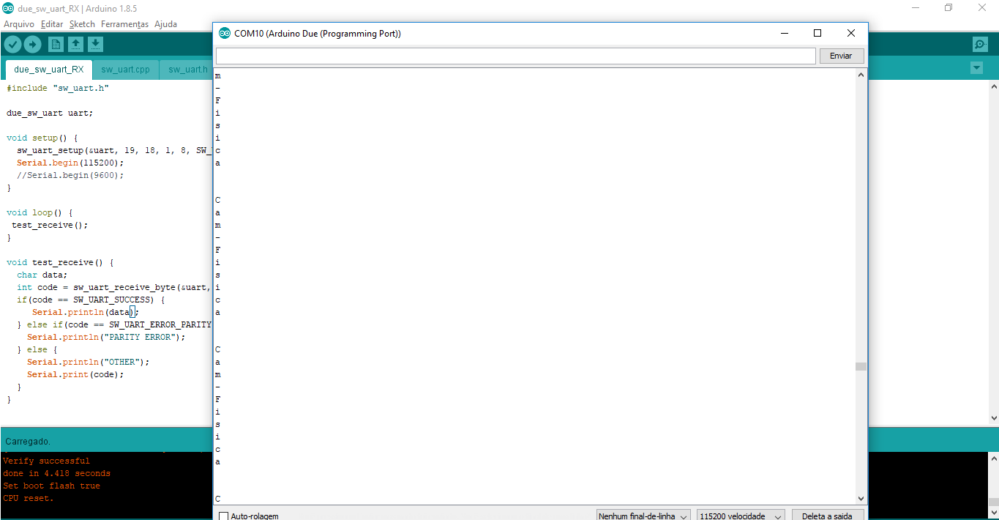
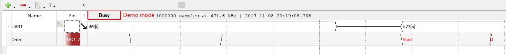

# CamFis4
Projeto 4 de Camada Física da Computação

## UART 

## Imagens da forma de onda gerada (Analog Discovery)

### Serial monitor printando letra por letra que recebe

### Serial monitor printando com a quebra de linha

### Analog recebendo dados do arduino

### Sinais podem ser 0 ou 1. No período transitório de sinais, há uma curva que o Analog constrói para representar tal transição.

## Codigo